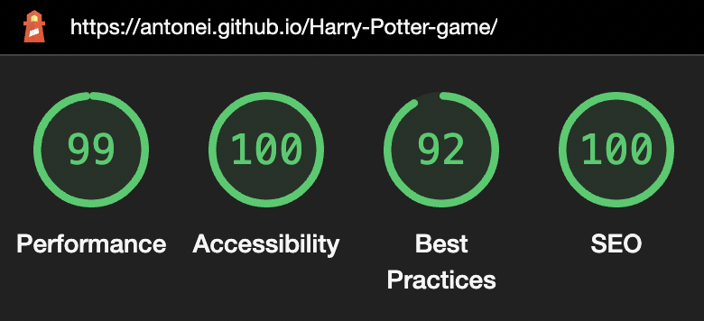

# Harry's Magical Jump Quest

Welcome to Harry's Magical Jump Quest, an enchanting game set in the magical world of Harry Potter! Immerse yourself in a thrilling adventure where you guide Harry to jump over Dobby and answer quizzes to earn points.

## Site Owner Goals

- To provide users with a captivating and entertaining gaming experience in the magical world of Harry Potter.
- To integrate quiz challenges to enhance user knowledge about the Harry Potter series through engaging gameplay.
- To implement a scoring mechanism to reward users for their skills and knowledge.
- To connect Harry Potter fans, encouraging them to share game experiences and achievements.

## User Stories

- ### First time use
  - As a first-time player, I want to quickly grasp the game's objective and the excitement of jumping over obstacles in the magical world of Harry Potter.
  - As a first-time player, I want an intuitive and enjoyable gameplay experience without the need for complex instructions.
  - As a first-time player, I want to dive into the game immediately without the requirement to sign up.
- ### Returning User
  - As a returning player, I want to seamlessly navigate through the game to relive the magical experience of guiding Harry through challenges.
  - As a returning player, I want to be able to learn more knowledge about the Harry potter movies
- ### Frequent user
  - As a frequent user I want to be able to master the art of timing Harry's jumps over Dobby
  - As a frequent user I want to be able to Celebrate success in the quiz phase by answering questions correctly

## Design

### Imagery
The Marauder's Map forms the backdrop, while the majestic Hogwarts Castle silhouette serves as the overall game background.

### Colours
The color scheme includes a dark background, inspired by the Marauder's Map, with warm tones of orange for buttons, creating a visually appealing contrast. White text ensures visibility against the intricate details of the map and castle.

### Fonts
The use of Google Fonts, specifically 'Cinzel Decorative' for headings and 'Merienda' for body text, enhances the magical and whimsical feel of the game.

### Wireframes

Wireframes were produced using Balsamiq.

## Features
### Home Page 
  The landing page of the website has a simple layout witck includes a H1 that says "Harry's Magical Jump Quest." Players are aslo greeted with a "Start Game" button, initiating the mystical quest.

### Gameplay
  - Control Harry's jumps with a simple click.
  - Score points as Harry successfully jumps over Dobby. Survive for more than 10 seconds to trigger a quiz challenge and earn additional rewards.

### Quiz Challenges
  - Test your Harry Potter knowledge with engaging quiz challenges.
  - Answer correctly to earn points and progress further in the game.

### Game over
Restarts the game after a loss, providing players with the opportunity to continue their magical journey and improve their performance.

### Features Left to Implement
- A scoreboard
- Some harry potter music

### Validator Testing

- #### HTML
  - No errors were returned when passing through the official W3C Markup Validator
    - [W3C Validator Results](https://validator.w3.org/nu/?doc=https%3A%2F%2Fantonei.github.io%2FHarry-Potter-game%2F)

- #### CSS
  - No errors were found when passing through the official W3C CSS Validator
    - [W3C CSS Validator Results](https://jigsaw.w3.org/css-validator/validator?uri=https%3A%2F%2Fantonei.github.io%2FHarry-Potter-game%2F&profile=css3svg&usermedium=all&warning=1&vextwarning=&lang=sv)

- #### Javascript
  - No errors or warnings were returned when passing through the the [JSHint Validator](https://jshint.com/)

### Accessibility

- The site achieved a Lighthouse accessibility score of 100% on both mobile and desktop which confirms that the colours and fonts chosen are easy to read and accessible

Mobile Lighthouse Score

Desktop Lighthouse Score

### Button Testing

-All buttons, including the Start button and the answer buttons in the quiz section, have been manually tested. They direct the user to the correct sections of the game.

### Game Mechanics Testing

- The game mechanics have been thoroughly tested to ensure a seamless and enjoyable user experience. Key aspects include:
  - Harry's Jumping Mechanism: Checked to ensure Harry jumps over Dobby correctly.
  - Dobby's Movement: Verified that Dobby moves towards Harry as expected.
  - Score Tracking: Ensured the scoring system increments correctly when Harry successfully jumps over Dobby.
  - Quiz Integration: Validated that the quiz section triggers when the user accumulates a certain score.
  - Quiz Questions: Confirmed that quiz questions are displayed randomly and that the correct answer progresses the game.
  - Game Over Handling: Checked that the game responds appropriately when Harry is hit by Dobby or when a wrong quiz answer is selected.

### Responsive Design

- The game has been tested across different screen sizes to ensure a responsive and visually appealing layout. Media queries have been implemented to adapt the game elements for a better user experience on various devices.

  - [Responsinator](http://www.responsinator.com/?url=https%3A%2F%2Fantonei.github.io%2FHarry-Potter-game%2F)

### Fixed Bugs

#### Double Points on Incorrect Quiz Answer

- When a user guessed the quiz question wrong, the game was restarting twice, resulting in double points being awarded.
- The issue was identified in the restartHarryGame function, specifically in the points calculation logic.
- The initialScore was being incremented on every restart, leading to the double points bug.
- To resolve this, the points increment logic was removed from the restartHarryGame function.

#### Game Continues After Dobby Hits Harry

- Previously, when the game restarted after Dobby hit Harry, the game did not stop. This led to unexpected behavior and a lack of synchronization between the game restart and the end condition.
- The issue was identified in the youLose function, responsible for handling the game-over condition.
- The clearInterval(checkDead); statement was not effectively stopping the game loop, allowing the game to continue.

### Known Bugs 
There are no known bugs.

## Technologies Used

### Languages
- JavaScript
- HTML5
- CSS3

### Frameworks - Libraries - Programs Used

- [Am I Responsive](http://ami.responsivedesign.is/) - Used to verify responsiveness of website on different devices.
- [Responsinator](http://www.responsinator.com/) - Used to verify responsiveness of website on different devices.
- [Balsamiq](https://balsamiq.com/) - Used to generate Wireframe images.
- [Chrome Dev Tools](https://developer.chrome.com/docs/devtools/) - Used for overall development and tweaking, including testing responsiveness and performance.
- [Font Awesome](https://fontawesome.com/) - Used for icons.
- [GitHub](https://github.com/) - Used for version control and hosting.
- [Google Fonts](https://fonts.google.com/) - Used to import and alter fonts on the page.
- [TinyPNG](https://tinypng.com/) - Used to compress images to reduce file size without a reduction in quality.
- [W3C](https://www.w3.org/) - Used for HTML & CSS Validation.
- [Favicon](https://favicon.io/) - Used to create the favicon.
- [JSHint](https://jshint.com/) - Used for JS Validation.

## Deployment 

The site was deployed using GitHub pages. The steps to deploy using GitHub pages are:

1. Go to the repository on GitHub.com
2. Select 'Settings' near the top of the page.
3. Select 'Pages' from the menu bar on the left of the page.
4. Under 'Source' select the 'Branch' dropdown menu and select the main branch.
5. Once selected, click the 'Save'.
6. Deployment should be confirmed by a message on a green background saying "Your site is published at" followed by the web address.

The live link can be found here - [Harry's Magical Jump Quest](https://antonei.github.io/Harry-Potter-game/)

## Cloning

To clone this repository follow the below steps:

1. Locate the repository at this link [Harry's Magical Jump Quest](https://github.com/AntonEi/Harry-Potter-game).
2. Under **'Code'**, see the different cloning options, HTTPS, SSH, and GitHub CLI. Click the prefered cloning option, and then copy the link provided.
3. Open **Terminal**.
4. In Terminal, change the current working directory to the desired location of the cloned directory.
5. Type **'git clone'**, and then paste the URL copied from GitHub earlier.
6. Type **'Enter'** to create the local clone.

## Credits

### Content

I would like to express my gratitude to [Web Dev Simplified](https://www.youtube.com/@WebDevSimplified) for invaluable tutorials and guidance. The implementation of the quiz section in this project

And thanks to the tutorial by [KnifeCircus](https://www.youtube.com/@KnifeCircus) for providing insights and guidance on implementing the Harry Dobby game.

### Media 

The pictures are from 

- <https://www.vhv.rs/viewpic/hxbTxhm_dobby-sculpture001-v-1533119561-harry-potter-dobby-png/#google_vignette> - Dobby
- https://www.pinterest.se/pin/779263541789919712/ - Harry
- https://100gamesvictorfanficstories.fandom.com/wiki/Hogwarts_School_of_Witchcraft_and_Wizardry - Hogwards
- https://www.pinterest.se/pin/168110998580862518/ - Marauder's Map

## Acknowledgments

My mentor Antonio for his support and advice.

My fellow student Elin Dalenbäck

The Code Institute slack community for their quick responses and very helpful feedback!
